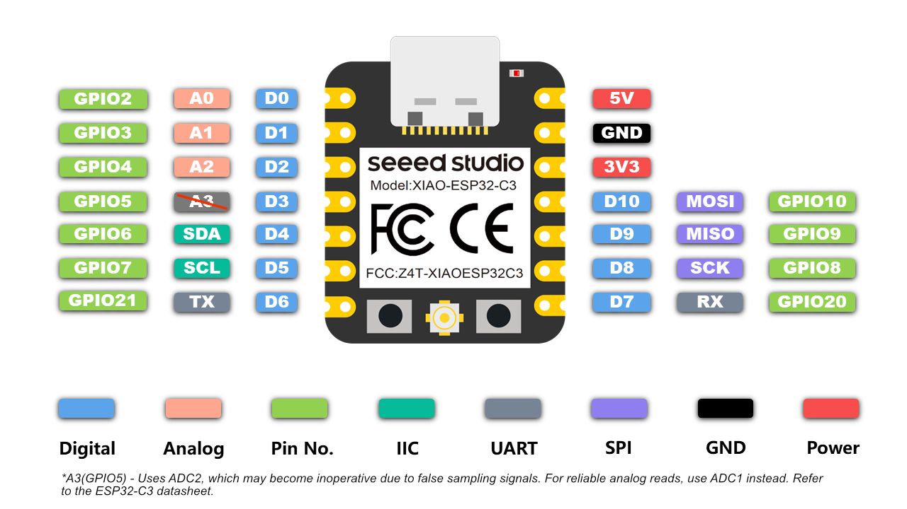

# Board Specs

We use the ESP32-C3 from seeedstudio.

## ESP32-C3 Specifications

[Source here](https://wiki.seeedstudio.com/XIAO_ESP32C3_Getting_Started)

- Processor: ESP32-C3, 32­bit RISC­-V single­core processor that operates at up to 160 MHz
- Memory: 400KB of SRAM, and 4MB of on-board flash memory
- Interfaces: 1xI2C, 1xSPI, 2xUART, 11xGPIO(PWM), 4xADC, 1xJTAG bonding pad interface

## Pin Layout

## Where do you get the boards from:

- [reichelt.com](https://www.reichelt.com/ch/en/shop/product/xiao_esp32c3_wifi_bt_without_header-358356)
- [bastelgarage.ch](https://www.bastelgarage.ch/seeed-studio-xiao-esp32-c3-1-2526?search=esp32c3)
