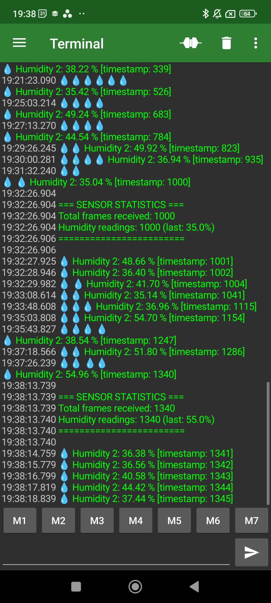

# Great Crates for embedded development

- [Embedded HAL](https://docs.rs/embedded-hal/)
- [Embedded HAL Async](https://docs.rs/embedded-hal-async/)
- [defmt](https://github.com/knurling-rs/defmt)
- [embassy](https://github.com/embassy-rs/embassy)
- [embassy book](https://embassy.dev/book/)

# Other tools

- Combining `esp_println` with the android app `serial_usb_terminal` by Kai Morich:  Just plug in USB and tap the 'connect' icon