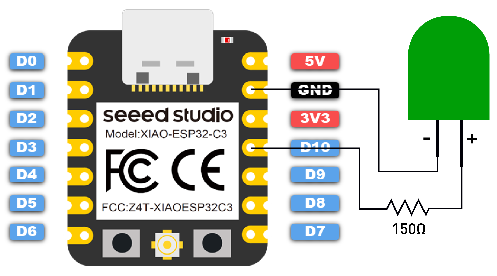

# Let's write a blinky project

Your task is now to create a small program, that sets the GPIO10 to `high` and back `low` in a loop in order to let your LED blink.

Before you connect your LED, make sure its connected to a 150-330 OHM resistor. Otherwise the LED will drain too much current from your board and could potentially damage it.

See the given image from seeedstudio:


<sub>Source: [Seeed Studio](https://wiki.seeedstudio.com/XIAO_ESP32C3_Getting_Started/#getting-started)</sub>

Reminder: You start a new esp project with

```sh
esp-generate --chip esp32c3 --headless -o probe-rs -o defmt <name of your project>
```

And

```sh
cargo run --release
```

to flash and run it.

If you are stuck, or want to see the solution: See `code/blinky`. In the root of the embedded-workshop.
